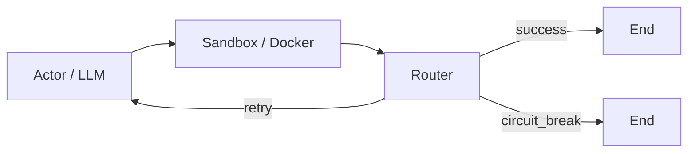

<div align="center">

# Self-Healing Coding Agent

### LangGraph · Reflexion · Docker sandbox · Production-minded defaults

**CN:** 基于 LangGraph 的「生成 → 沙盒执行 → 路由熔断 → 可选持久化」闭环：把不可信的 LLM 输出约束在可观测、可回放的工程边界内。  
**EN:** A LangGraph workflow that runs **generate → sandbox → route → (optional) checkpoint**, keeping LLM-produced code inside an observable, replayable boundary.

[](./.github/workflows/ci.yml)
[](https://www.python.org)
[](https://www.docker.com/)

<sub>**Badge tip:** Replace the CI badge with your repo’s live status image after publishing.</sub>

</div>

---

## Overview | 概述

| | **English** | **中文** |
|---|-------------|----------|
| **Problem** | Raw LLM code execution on the host is unsafe; blind retries waste tokens and hide failures. | 在宿主机上直接执行模型生成的代码风险极高；无节制重试烧 Token 且难以审计。 |
| **Approach** | Docker-isolated runs, dual success criteria (`exit_code` + stdout marker), smart log truncation, pooled async HTTP client, circuit breaker routing. | Docker 隔离执行、双重通过判定（退出码 + stdout 标记）、智能日志截断、异步连接池、路由熔断。 |

---

## Architecture | 架构

### Diagram placeholder | 架构图占位

> **EN:** Drop your canonical diagram here (`docs/architecture.png`) or render Mermaid on GitHub.  
> **CN:** 建议在此处放置正式架构图（PNG/SVG）或直接使用下方 Mermaid（GitHub 原生渲染）。




---

## 💡 Architecture & Design Rationale | 核心架构设计与亮点

### 1. Isomorphic Sandbox Execution (高防物理隔离沙盒)
- **Design**: Implemented a stateless, Docker-based task runner enforcing strict boundary control.
- **Features**: Utilized Linux `cgroups` and `namespaces` to cap resources (`mem_limit=128m`, `pids_limit=64`, `cpu_quota`). Configured read-only mounts (`ro`) and air-gapped networking (`network_disabled=True`) to prevent malicious prompt injection or container escape.
- **亮点**: 彻底抛弃裸机执行，采用 Docker 构建无状态沙盒。深入内核层级，利用 Cgroups 压制内存与防范 Fork Bomb，彻底隔离网络与文件系统写权限，确保 Agent 与宿主机的绝对安全边界。

### 2. High-Concurrency LLM Client Infrastructure (高并发 LLM 底层通信基建)
- **Design**: Built a thread-safe, singleton asynchronous HTTPX client designed for high throughput.
- **Features**: Applied the Double-Checked Locking (DCL) pattern for lazy initialization, avoiding Event Loop attachment conflicts. Customized connection pool limits (`max_connections=100`) and 4-stage granular timeouts (`read=30.0s`) to prevent socket leaks and mitigate upstream API degradation.
- **亮点**: 弃用原生 SDK 黑盒，手搓底层 HTTPX 异步连接池。采用双重校验锁（DCL）实现安全的全局单例，配合精细的 4 阶段超时控制与优雅退役（Graceful Shutdown）机制，彻底解决高并发场景下的 FD（文件描述符）泄漏与雪崩问题。

### 3. Self-Healing State Machine & Precise Patching (自愈状态机与精准补丁应用)
- **Design**: Orchestrated a robust `LangGraph` workflow with integrated circuit breakers and checkpointing.
- **Features**: Engineered an AST/Regex-based patch application algorithm that processes LLM outputs via `Search/Replace` blocks. Implemented `re.DOTALL` logic to strip `<think>` tags, preventing Tokenizer pollution, and enabled fuzzy heuristic fallbacks to counter LLM whitespace hallucinations.
- **亮点**: 引入 Checkpointer 实现状态持久化与断点恢复。设计基于 `<think>` 标签降噪与 Search/Replace 的精准合并算法，完美化解 LLM 排版幻觉。结合 Router 实现基于重试阈值的熔断机制，杜绝 Token 损耗黑洞。

### 4. Quantitative Evaluation Pipeline (量化评估引擎)
- **Design**: Developed an integrated evaluation harness (`eval_runner.py`) for automated benchmark testing.
- **Features**: Facilitates systematic tracking of First-Pass Fix Rates and multi-turn Reflexion success metrics, ensuring data-driven iterative improvements.
- **亮点**: 内置定制化的量化评测流水线，支持对 Agent 的首通率（First-Pass Rate）及反思收敛率进行系统性基准测试，将“玩具 Demo”升维至“数据驱动的工程化系统”。

---

## Repository layout | 项目结构

```
coding_agent_oss/
├── main.py                 # Graph wiring & demo entry
├── core/                   # State, nodes, router, sandbox, patch merge
├── tests/                  # pytest suite + fixtures
├── eval_runner.py          # Batch async evaluation harness (JSONL)
├── pytest.ini / .coveragerc
├── requirements.txt
├── requirements-dev.txt
└── .github/workflows/ci.yml
```

---

## Quick start | 快速开始

**Prerequisites | 环境:** Python 3.10+, Docker running, LLM API key.

```bash
python -m venv .venv
# Windows: .venv\Scripts\activate
# Unix:    source .venv/bin/activate

pip install -r requirements-dev.txt
cp .env.example .env   # fill OPENAI_* variables

docker pull python:3.10-slim   # sandbox image (first run)
python main.py
```

---

## Testing | 测试

**EN:** Tests assume the repository root is on `PYTHONPATH` (handled via `tests/conftest.py`). Coverage gate is enforced in `pytest.ini` (`--cov-fail-under=80`).

**CN:** `conftest.py` 已将仓库根目录加入 `sys.path`。覆盖率阈值由 `pytest.ini` 强制（默认 ≥80%）。

```bash
pytest                         # full suite + coverage summary
pytest tests/test_router.py -v # focused module
pytest -k "circuit_break"      # keyword filter

# HTML report (local artifact; listed in .gitignore)
pytest && start htmlcov/index.html    # Windows
pytest && open htmlcov/index.html     # macOS
```

---

## Configuration | 配置

| Variable | Required | Notes |
|----------|----------|-------|
| `OPENAI_API_KEY` | Yes | Provider key |
| `OPENAI_BASE_URL` | No | Compatible OpenAI-style endpoint |
| `OPENAI_MODEL` | No | Default model id |

Tune sandbox caps in `core/sandbox.py` (`SANDBOX_*` constants).

---

## Security disclaimer | 安全声明

**EN:** This demo prioritizes clarity. Harden for production: dynamic pass markers, stronger isolation (e.g. gVisor/Kata), secrets management, rate limits, and outbound policy.

**CN:** 本仓库偏演示与学习用途。生产环境请加强隔离策略、密钥治理、动态 Marker、出口流量治理与配额控制。

---

## License | 许可证

本项目采用 [MIT License](LICENSE) 开源。

---

<div align="center">
<sub>Built with LangGraph, Docker, and defensive defaults.</sub>
</div>
