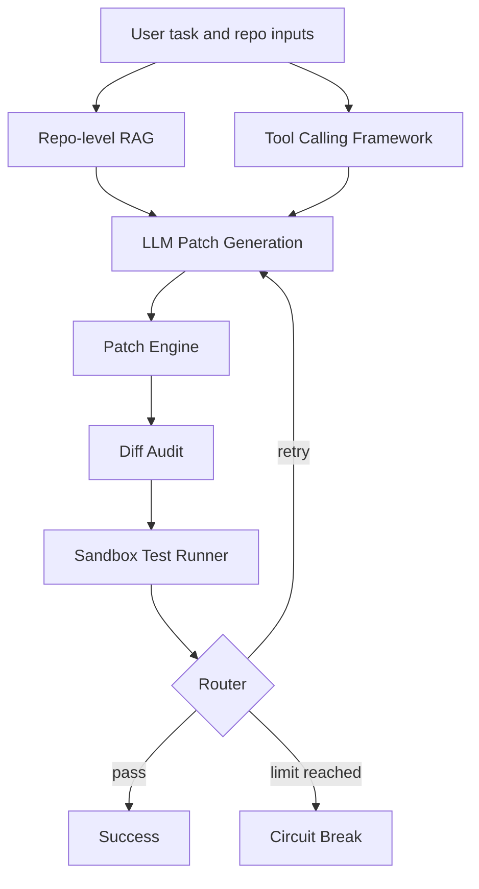

# Coding Agent OSS

Coding Agent OSS is an automatic code-repair Coding Agent for real local code
repositories. It combines repo-level context retrieval, deterministic tool
calling, safe patch application, diff audit, reproducible benchmark reporting,
and an MCP Server Adapter.

This is not a large-scale SWE-bench runner. The current benchmark suite is a
small reproducible toy benchmark pipeline used to verify the repair plumbing and
reporting flow.

## Overview

The project implements a self-healing repair loop:

1. Load buggy code, tests, user request, error logs, and optional repository context.
2. Retrieve relevant repository evidence with Repo-level RAG.
3. Run deterministic pre-patch tools for file listing, search, file reads, git diff, and optional tests.
4. Ask the LLM to produce a minimal patch.
5. Parse, validate, dry-run, apply, rollback on failure, and audit the diff.
6. Execute tests in a Docker sandbox and route success, retry, or circuit break.

Recent local validation: `169 passed` with `python -m pytest`.

## Why This Project

Raw LLM code generation is easy to demo and hard to operate safely. Real
repository repair needs stronger boundaries:

- Repository context must be retrieved without dumping the whole repo into a prompt.
- Tools must be deterministic, bounded, and auditable.
- Patches must be parsed and validated before touching files.
- Diff output should be inspected and summarized.
- Evaluation should be reproducible, not just anecdotal.
- External agents should be able to reuse safe repository-analysis tools through MCP.

## Core Features

- **Repo-level RAG**: scans local repositories, chunks Python and Java-like source files, and retrieves context using user request, error logs, failing tests, and target file.
- **Tool Calling Framework**: internal `ToolDefinition`, `ToolRegistry`, `ToolExecutor`, `ToolResult`, and `ToolTrace` abstractions for deterministic tools.
- **Patch Engine**: supports Search/Replace and basic Unified Diff patch flows with validation, dry-run, apply, and rollback.
- **Diff Audit**: records changed files, added/deleted lines, suspicious-change signals, and truncated diff metadata.
- **Benchmark Report**: runs toy repair tasks in mock mode and generates JSON, Markdown, and CSV reports.
- **MCP Server Adapter**: exposes selected internal tools as MCP tools over stdio.

## Architecture



## Workflow

The default agent workflow remains a single-file repair loop when no
`repo_root` is provided. Repo-aware features are additive and fail open:

- Missing or invalid `repo_root` falls back to the original single-file flow.
- Tool failures are recorded but do not crash the repair loop.
- Patch Engine failures record structured state and fall back where safe.
- Benchmark and MCP modules are optional side modules; they do not rewrite the core agent.

## Module Breakdown

### Repo-level RAG

Located in `rag/`. The RAG path scans repository files, chunks source code, and
uses a lightweight hybrid retrieval strategy. It is primarily keyword and
metadata based today; it is not a FAISS/Chroma vector database pipeline.

### Tool Calling Framework

Located in `tools/`. Built-in tools include:

- `list_files`
- `read_file`
- `search_code`
- `grep_code`
- `git_diff`
- `run_tests`

Safety is centralized around repo-root path resolution, sensitive file blocking,
allowlisted test commands, timeouts, and output truncation.

### Patch Engine & Diff Audit

Located in `patching/`. The patch layer supports:

- Search/Replace patch parsing
- Basic Unified Diff parsing
- Unique Search/Replace match validation
- Dry-run
- Apply
- Rollback on failure
- Git diff audit

The existing `core/patch_apply.py` behavior is preserved for the original
single-file repair path.

### Benchmark & Report

Located in `benchmark/`. Mock mode uses preset patch outputs for toy tasks, then
still runs the real PatchParser, PatchValidator, PatchApplier, DiffAuditor, RAG
retrieval, tool pass, and report generation.

Report formats:

- JSON for programmatic analysis
- Markdown for human review
- CSV for spreadsheet analysis

### MCP Server Adapter

Located in `mcp_adapter/`. The adapter exposes selected internal tools through
MCP tools and keeps execution delegated to the existing `ToolRegistry` and
`ToolExecutor`.

Current scope:

- Server Adapter only
- stdio transport only
- no MCP Client
- no authentication system
- `apply_patch` is not exposed
- `run_tests` is disabled unless explicitly enabled

## Quick Start

Prerequisites:

- Python 3.10+
- Docker, for sandbox execution
- An OpenAI-compatible API key for real LLM repair runs

Install dependencies:

```bash
pip install -r requirements.txt
```

For local development and tests:

```bash
pip install -r requirements-dev.txt
```

Configure the LLM environment for real agent runs:

```bash
cp .env.example .env
```

Then set `OPENAI_API_KEY`, and optionally `OPENAI_BASE_URL` and `OPENAI_MODEL`.

Run the basic app entry:

```bash
python main.py
```

## Run Tests

```bash
python -m pytest
```

Focused examples:

```bash
python -m pytest tests/test_nodes.py
python -m pytest tests/test_tool_executor.py
python -m pytest tests/test_patch_applier.py
```

## Run Benchmark

Run the reproducible toy benchmark pipeline:

```bash
python -m benchmark.cli --tasks-dir benchmark/tasks --output-dir benchmark/results --mode mock --formats json markdown csv
```

`benchmark/results/` is ignored by git.

## MCP Server Usage

Start the MCP server adapter with stdio transport:

```bash
python -m mcp_adapter.server --repo-root . --transport stdio
```

Enable the `run_tests` MCP tool explicitly:

```bash
python -m mcp_adapter.server --repo-root . --transport stdio --enable-test-tool
```

Example client configuration:

```text
examples/mcp_client_config.example.json
```

If the MCP Python SDK is not installed, normal Agent, RAG, Tool, Patch, and
Benchmark tests still run. Starting the MCP server will print a clear dependency
error.

## Safety Design

The project is built around defensive defaults:

- Docker sandbox execution for generated code.
- Repo-local path resolution for tools and patching.
- Sensitive file blocking for `.git`, `.env`, private keys, token-like files, and secret-like files.
- `run_tests` uses an allowlist and never arbitrary shell execution.
- Subprocess calls use list arguments and `shell=False`.
- Tool and diff outputs are truncated before entering prompts or reports.
- Patch Engine performs validation and dry-run before applying changes.
- Diff Audit records changed files and suspicious-change signals.
- MCP does not expose `apply_patch` by default.

## Benchmark Notes

The benchmark module is intended to make repair behavior reproducible. It
currently ships with small toy tasks and mock-mode patch outputs. It should be
read as a local evaluation harness, not as evidence of broad real-world repair
success.

Current metrics include success count, success rate, first-pass success,
multi-turn success, failure breakdown, patch success rate, RAG chunk count, tool
call count, and diff size.

## Limitations

- Repo-level RAG is currently lightweight keyword/hybrid retrieval, not a full vector search stack.
- Java parsing is lightweight regex-style chunking, not Tree-sitter.
- Unified Diff support is basic and not equivalent to full `git apply` semantics for every edge case.
- Benchmark task count is limited and toy-focused.
- Real mode benchmark is not a complete batch evaluation of real LLM agent runs.
- MCP support is a Server Adapter only, with stdio transport and no MCP Client implementation.
- MCP has not been validated with an end-to-end external client integration test in this repo.

## Roadmap

- Expand benchmark tasks beyond toy examples.
- Add regression benchmark suites for common repair patterns.
- Improve retrieval with optional vector indexing.
- Add Tree-sitter based parsing for richer multi-language support.
- Add MCP stdio client integration tests.
- Add optional confirmation workflows for risky tools.

## License

MIT License. See [LICENSE](LICENSE).
